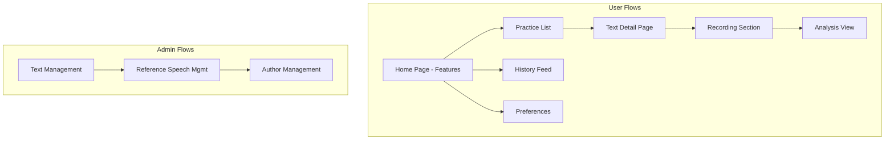
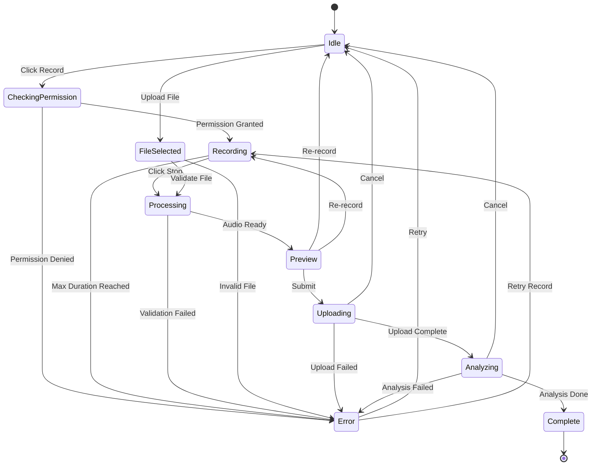

# Nonce UX/UI Specification

## Architecture Overview



---

## Route Structure

| Route                                    | Purpose                     | Auth Required | Layout  |
| ---------------------------------------- | --------------------------- | ------------- | ------- |
| `/`                                      | Feature showcase (home)     | Yes           | Main    |
| `/practice`                              | Practice text list          | Yes           | Main    |
| `/practice/$textId`                      | Text detail with recording  | Yes           | Main    |
| `/practice/$textId/analysis/$analysisId` | Analysis results            | Yes           | Main    |
| `/feed`                                  | User history feed           | Yes           | Main    |
| `/settings`                              | User preferences            | Yes           | Main    |
| `/admin/texts`                           | Text CRUD (exists)          | Yes (Admin)   | Main    |
| `/admin/references`                      | Reference speech management | Yes (Admin)   | Main    |
| `/admin/authors`                         | Author management           | Yes (Admin)   | Main    |
| `/login`                                 | Authentication              | No            | Minimal |

**Route Parameters:**
- `$textId`: UUID string (required)
- `$analysisId`: UUID string (required)

**Navigation Patterns:**
- All routes support browser back/forward navigation
- Breadcrumbs shown on nested routes (e.g., Home > Practice > Text > Analysis)
- Back button in header navigates to parent route
- Deep links supported for all routes
- Home page (`/`) serves as feature showcase and entry point
- Practice flows start from `/practice` (text selection)

---

## Navigation Bar Component

### Layout Structure

**Desktop Layout:**
```
+------------------------------------------------------------------+
| [Logo]  [Home] [Practice] [Feed] [Settings]  [Theme] [User]    |
+------------------------------------------------------------------+
```

**Mobile Layout:**
```
+------------------------------------------+
| [Logo]                    [☰] [Theme] [User] |
+------------------------------------------+
| (Hamburger menu expands below)          |
| [Home] [Practice] [Feed] [Settings]      |
+------------------------------------------+
```

### Component Specification

**Props:**
```typescript
interface NavbarProps {
  currentRoute?: string;
  isAdmin?: boolean;
  user?: User | null;
}
```

**States:**

| State            | Description               | UI Behavior                                 |
| ---------------- | ------------------------- | ------------------------------------------- |
| Default          | Normal navigation         | All links visible, active route highlighted |
| Mobile Menu Open | Mobile hamburger expanded | Menu overlay/dropdown visible               |
| Loading          | User data loading         | Skeleton for user button area               |
| Authenticated    | User signed in            | UserButton component visible                |
| Unauthenticated  | User signed out           | Sign In button visible                      |

### Components

- `Navbar`: 
  - Main navigation container
  - Props: `{ currentRoute?: string, isAdmin?: boolean }`
  - Responsive: Desktop horizontal nav, mobile hamburger menu
  - Sticky: Fixed to top on scroll (optional, configurable)
  - Background: Transparent or solid based on scroll position
  - Border: Bottom border (subtle, matches theme)

- `NavLogo`: 
  - Props: `{ href?: string, onClick?: () => void }`
  - Logo/brand name (Nonce)
  - Clickable: Navigates to `/`
  - Size: Responsive (smaller on mobile)
  - Hover: Subtle scale or opacity change

- `NavLink`: 
  - Props: `{ to: string, label: string, icon?: ReactNode, isActive?: boolean }`
  - Navigation link with optional icon
  - Active state: Highlighted (underline, background, or color change)
  - Hover: Subtle background or color change
  - Keyboard: Tab navigation, Enter to activate
  - Accessibility: `aria-current="page"` when active

- `NavMenu` (Mobile): 
  - Props: `{ isOpen: boolean, onClose: () => void, children: ReactNode }`
  - Mobile hamburger menu
  - Animation: Slide down or fade in (300ms)
  - Overlay: Backdrop with click-to-close
  - Escape key: Closes menu
  - Focus trap: When open, focus stays within menu

- `ThemeToggle`: 
  - Props: `{ variant?: 'icon' | 'button' }`
  - Toggle between light/dark theme
  - Icon: Sun/Moon icon
  - Tooltip: "Toggle theme" on hover
  - Keyboard: Space/Enter to toggle
  - Persists preference in localStorage

- `UserAuthSection`: 
  - Props: `{ user?: User | null }`
  - Shows `UserButton` when authenticated (Clerk)
  - Shows `SignInButton` when unauthenticated
  - Loading: Skeleton placeholder
  - Dropdown: User menu (profile, settings, sign out)

- `AdminNavLink`: 
  - Props: `{ to: string, label: string }`
  - Only visible when `isAdmin === true`
  - Links to admin routes (`/admin/*`)
  - Visual distinction: Different color or badge
  - Grouped separately or inline with main nav

### Navigation Links

**Main Navigation (Always Visible):**
- **Home** (`/`): Feature showcase page
- **Practice** (`/practice`): Practice text list
- **Feed** (`/feed`): User history and insights
- **Settings** (`/settings`): User preferences

**Admin Navigation (Conditional):**
- **Admin Dashboard** (`/admin/`): Admin overview
- **Texts** (`/admin/texts`): Text management
- **References** (`/admin/references`): Reference management
- **Authors** (`/admin/authors`): Author management

**Admin Links Display Options:**
1. **Separate Section**: Admin links in dropdown or separate nav section
2. **Inline**: Admin links mixed with main nav (with badge/indicator)
3. **User Menu**: Admin links in user dropdown menu

### Responsive Behavior

**Breakpoints:**
- **Desktop (lg: 1024px+)**: Full horizontal navigation
- **Tablet (md: 768px - 1023px)**: Full horizontal navigation (condensed)
- **Mobile (< 768px)**: Hamburger menu

**Mobile Menu:**
- Trigger: Hamburger icon (☰) in top-right
- Animation: Slide down from top (300ms ease-out)
- Overlay: Semi-transparent backdrop
- Close: X icon, click outside, or Escape key
- Full width: Menu takes full viewport width
- Stack: Links stack vertically with spacing

### Active Route Highlighting

**Visual Indicators:**
- **Underline**: Active link has bottom border (2px, primary color)
- **Background**: Active link has subtle background color
- **Color**: Active link uses primary/foreground color
- **Bold**: Active link text is bold or semibold

**Route Matching:**
- Exact match: `/practice` matches `/practice` exactly
- Prefix match: `/practice/$textId` also highlights `/practice` link
- Admin routes: `/admin/*` highlights admin section

### Accessibility

**Keyboard Navigation:**
- Tab: Navigate through links
- Enter/Space: Activate link
- Escape: Close mobile menu
- Arrow keys: Navigate within menu (optional enhancement)

**ARIA Labels:**
- `aria-label="Main navigation"` on nav element
- `aria-current="page"` on active link
- `aria-expanded` on mobile menu button
- `aria-controls` linking menu button to menu

**Screen Reader:**
- Announce active page
- Announce menu open/close
- Descriptive labels for all interactive elements

### Styling & Theming

**Colors:**
- Background: Transparent or solid (based on scroll)
- Border: Subtle bottom border (matches theme)
- Active link: Primary color or foreground
- Hover: Subtle background or color change
- Text: Foreground color (theme-aware)

**Spacing:**
- Desktop: 24px horizontal padding between links
- Mobile: 16px vertical padding in menu
- Container: Max-width container with padding

**Typography:**
- Font size: Base (16px) or sm (14px)
- Weight: Regular (400) for links, Semibold (600) for active
- Line height: 1.5

### States & Interactions

**Hover:**
- Link: Subtle background or color change (150ms transition)
- Logo: Slight scale (1.05) or opacity change
- Button: Standard button hover states

**Active:**
- Link: Visual indicator (underline, background, or color)
- Button: Pressed state (slight scale down)

**Loading:**
- User section: Skeleton loader
- Navigation: Links visible immediately (no loading state needed)

**Error:**
- Navigation always available (no error state)
- User section: Fallback to sign in button if auth fails

### Implementation Notes

**Component Structure:**
```
<Navbar>
  <NavLogo />
  <NavMenu> (desktop: horizontal, mobile: hamburger)
    <NavLink to="/" />
    <NavLink to="/practice" />
    <NavLink to="/feed" />
    <NavLink to="/settings" />
    {isAdmin && <AdminNavSection />}
  </NavMenu>
  <ThemeToggle />
  <UserAuthSection />
</Navbar>
```

**Integration:**
- Placed in root layout (`__root.tsx`)
- Available on all routes (except `/login` which uses minimal layout)
- Uses TanStack Router `Link` for navigation
- Uses Clerk for authentication state
- Uses theme context for theme toggle

**Performance:**
- No lazy loading needed (always visible)
- Minimal re-renders (only on route/auth changes)
- CSS transitions for animations (not JS)

---

## User Flows

### 1. Home Page - Feature Showcase (`/`)

**Layout:**

```
+------------------------------------------+
| Hero Section                             |
| "Improve Your English Pronunciation"     |
+------------------------------------------+
| Feature Cards Grid                       |
| [Practice Texts] [Get Insights]          |
| [IPA Knowledge] [Visual Guides]          |
+------------------------------------------+
| User Global Summary                       |
| [Total Practice: 47] [Avg Score: 76%]    |
+------------------------------------------+
| Educational Content                       |
| [Articulation Visuals] [Tips & Tricks]   |
+------------------------------------------+
```

**States:**

| State   | Component             | Description                   |
| ------- | --------------------- | ----------------------------- |
| Loading | `FeatureSkeleton`     | Hero + feature cards skeleton |
| Loaded  | Full feature showcase | All sections visible          |
| Error   | `ErrorState`          | Retry button + error message  |

**Components:**

- `HeroSection`: 
  - Props: `{ title: string, subtitle: string, cta?: { label: string, href: string } }`
  - Large heading, subtitle, optional CTA button
  - Links to `/practice` or scrolls to features
- `FeatureCard`: 
  - Props: `{ title: string, description: string, icon: ReactNode, href: string, color?: string }`
  - Icon, title, description, link to feature
  - Hover: subtle scale (1.02) and shadow elevation
  - Main features:
    - **Practice Texts**: Links to `/practice`
    - **Get Insights**: Links to `/feed`
    - **IPA Knowledge**: Educational content (modal or page)
    - **Visual Guides**: Articulation visuals (modal or page)
- `UserSummary`: 
  - Props: `{ totalPractice: number, averageScore: number, weeklyProgress: number }`
  - Quick stats cards (3-4 metrics)
  - Links to `/feed` for detailed view
  - Empty state: "Start practicing to see your progress"
- `ArticulationVisual`: 
  - Props: `{ sound: string, ipa: string, visual: ReactNode, description: string }`
  - Interactive visuals showing mouth/tongue position
  - Click to hear pronunciation
  - Carousel or grid of common sounds
- `EducationalContent`: 
  - Props: `{ type: 'tip' | 'guide' | 'article', content: ReactNode }`
  - Tips, guides, articles about pronunciation
  - Collapsible sections or expandable cards
- `IPAKnowledgeSection`: 
  - Props: `{ sounds: IPASound[], onSoundClick?: (sound: string) => void }`
  - Interactive IPA chart or common sounds grid
  - Click sound to hear pronunciation and see articulation guide
  - Links to detailed IPA guide page (future)
- `ArticulationVisuals`: 
  - Props: `{ sounds: string[], onSoundSelect: (sound: string) => void }`
  - Visual guides showing mouth/tongue position for specific sounds
  - Interactive 3D or 2D illustrations (or animated GIFs)
  - Common sounds: /θ/, /ð/, /r/, /l/, etc.
  - Click to see visual and hear example

**Content Sections:**
1. **Hero**: Main value proposition, primary CTA to practice
2. **Practice Texts Feature**: Card linking to `/practice` with preview
3. **Get Insights Feature**: Card linking to `/feed` with stats preview
4. **IPA Knowledge**: Interactive IPA chart or common sounds
5. **User Summary**: Quick stats (if logged in) or "Get Started" CTA
6. **Articulation Visuals**: Visual guides for difficult sounds
7. **Educational Tips**: Tips, tricks, best practices

**Success States:**
- After successful load: staggered fade-in (hero first, then features)
- Smooth scroll to sections on CTA click
- User summary animates numbers on load

**Error Recovery:**
- Retry button: refetches data with loading state
- Partial errors: Show available content, hide failed sections
- User summary error: Hide section or show "Start practicing" message

---

### 2. Practice Page - Text Selection (`/practice`)

**States:**

| State   | Component          | Description                         |
| ------- | ------------------ | ----------------------------------- |
| Loading | `TextListSkeleton` | 6 skeleton cards in grid            |
| Empty   | `EmptyState`       | "No texts available" + contact info |
| Loaded  | `TextCard` grid    | Clickable cards with text preview   |
| Error   | `ErrorState`       | Retry button + error message        |

**Components:**

- `TextCard`: 
  - Props: `{ textId: string, content: string, wordCount: number, referenceCount: number }`
  - Shows text preview (line-clamp-5), word count, reference count badge
  - Clickable: navigates to `/practice/$textId`
  - Hover: subtle scale (1.02) and shadow elevation
  - Loading state: skeleton shimmer animation
- `TextListSkeleton`: 
  - 6 animated placeholder cards in grid
  - Pulse animation (2s duration, infinite)
  - Matches `TextCard` dimensions
- `EmptyState`: 
  - Props: `{ icon?: ReactNode, title: string, description: string, action?: { label: string, onClick: () => void } }`
  - Icon (optional), title, description, optional action button
  - Centered layout with max-width constraint

**Success States:**
- After successful text load: smooth fade-in (300ms)
- No success toast needed (data is the feedback)

**Error Recovery:**
- Retry button: refetches data with loading state
- Error persists until user action or successful retry

---

### 3. Text Detail Page (`/practice/$textId`)

**Layout:**

```
+------------------------------------------+
| Header (back nav + title)                |
+------------------------------------------+
| Text Content (full)                      |
+------------------------------------------+
| Reference Speech Selector                |
+------------------------------------------+
| Audio Player (reference)                 |
+------------------------------------------+
| Recording Section                        |
| [Record] [Upload]                        |
+------------------------------------------+
| Recent Attempts (latest 3)               |
+------------------------------------------+
```

**States:**

| State | Component | Description |

|-------|-----------|-------------|

| Loading | `TextDetailSkeleton` | Full page skeleton |

| Error | `ErrorState` | Text not found / server error |

| No references | `EmptyReferences` | Admin prompt to add references |

| Ready | Full component | Ready to record |

**Components:**

- `ReferenceSelector`: 
  - Props: `{ textId: string, selectedReferenceId?: string, onSelect: (referenceId: string) => void }`
  - Dropdown with author name, accent badge, duration
  - Shows "No references" state when empty
  - Loading: skeleton dropdown
- `AudioPlayer`: 
  - Props: `{ audioUrl: string, waveformData?: number[], onPlay?: () => void, onPause?: () => void }`
  - Play/pause button, progress bar, time display (current/total), waveform visualization
  - Keyboard: Space to play/pause, Arrow keys for seek (5s increments)
  - Auto-pause when navigating away
- `RecordingSection`: 
  - Props: `{ textId: string, referenceId: string, onComplete: (recordingId: string) => void }`
  - Mode toggle (record/upload), controls, waveform
  - See detailed states in Recording Section (4)
- `RecentAttempts`: 
  - Props: `{ textId: string, limit?: number }`
  - List of latest 3 attempts with scores, dates, links to analysis
  - Empty state: "No attempts yet" message
  - Clickable: navigates to analysis page

**Success States:**
- After successful text load: fade-in content (300ms)
- After reference selection: smooth audio player appearance

**Error Recovery:**
- Text not found: redirect to `/practice` with toast notification
- Reference load error: show error message with retry

---

### 4. Recording Section

**Sub-states:**

| State | UI | Actions |

|-------|-----|---------|

| Idle | [Record] [Upload] buttons | Start recording or trigger file picker |

| Recording | Live waveform + timer + [Stop] | Stop recording |

| Processing | Spinner + "Processing audio..." | None (wait) |

| Preview | Waveform + [Play] [Re-record] [Submit] | Play back, retry, or submit |

| Uploading | Progress bar + "Uploading..." | Cancel |

| Analyzing | Animated pulse + "Analyzing pronunciation..." | None (wait) |

| Error | Error message + [Retry] | Retry action |

**Error Types:**

| Error                  | Message                                           | Recovery                     | User Action               |
| ---------------------- | ------------------------------------------------- | ---------------------------- | ------------------------- |
| Microphone denied      | "Microphone access required"                      | Settings link                | Opens browser permissions |
| Microphone unavailable | "No microphone detected"                          | Check device message         | Manual retry              |
| Audio too short        | "Recording must be at least 1 second"             | Auto-return to Idle          | Re-record                 |
| Audio too long         | "Maximum 60 seconds"                              | Auto-stop at limit           | Submit or re-record       |
| Audio quality: reject  | "Poor audio quality detected"                     | Re-record prompt             | Must re-record            |
| Audio quality: warning | "Audio quality is acceptable but could be better" | Continue or re-record choice | User decides              |
| Upload failed          | "Upload failed. Please check your connection"     | Retry button                 | Retry upload              |
| Upload timeout         | "Upload timed out"                                | Retry button                 | Retry upload              |
| File too large         | "File must be under 10MB"                         | File picker re-opens         | Select different file     |
| Invalid format         | "Only WAV, MP3, M4A, OGG supported"               | File picker re-opens         | Select different file     |
| Analysis failed        | "Analysis unavailable. Please try again"          | Retry with same recording    | Retry analysis            |
| Analysis timeout       | "Analysis is taking longer than expected"         | Show progress, allow cancel  | Wait or cancel            |

**State Transitions:**
- Idle → Recording: Immediate (microphone permission check first)
- Recording → Processing: 200ms delay (audio processing)
- Processing → Preview: When audio blob ready
- Processing → Error: On validation failure
- Preview → Uploading: On submit click
- Uploading → Analyzing: On upload success (100%)
- Analyzing → Complete: Navigate to analysis page
- Any state → Error: Show error message, allow retry

**Components:**

- `AudioRecorder`: 
  - Props: `{ onComplete: (audioBlob: Blob) => void, maxDuration?: number }`
  - Waveform visualization (real-time), timer (MM:SS), controls
  - Auto-stop at max duration with warning at 5s remaining
  - Visual feedback: red pulse when recording, green when stopped
- `FileDropzone`: 
  - Props: `{ onFileSelect: (file: File) => void, acceptedFormats?: string[] }`
  - Drag-drop zone with format hints (WAV, MP3, M4A, OGG)
  - Visual feedback: border highlight on drag-over
  - File validation before processing
- `AudioQualityIndicator`: 
  - Props: `{ snr: number, clipping: boolean, silence: number }`
  - SNR meter (0-100), clipping indicator (red when detected), silence detection
  - Color-coded: green (good), yellow (warning), red (poor)
- `UploadProgress`: 
  - Props: `{ progress: number, onCancel?: () => void }`
  - Progress bar with percentage (0-100%)
  - Cancel button (only during upload, not analysis)
- `AnalysisProgress`: 
  - Props: `{ stage: 'uploading' | 'processing' | 'analyzing', message?: string }`
  - Animated pulse with stage indicator
  - Stage messages: "Uploading...", "Processing audio...", "Analyzing pronunciation..."

**Success States:**
- After successful upload: progress bar completes, transitions to analyzing
- After successful analysis: automatic navigation to analysis page with success toast

---

### 5. Analysis Results Page (`/practice/$textId/analysis/$analysisId`)

**Layout:**

```
+------------------------------------------+
| Header (back to practice text)           |
+------------------------------------------+
| Score Overview                           |
| [Overall: 85%] [Phoneme: 82%] [Word: 88%]|
+------------------------------------------+
| Sentence Comparison                      |
| Target:    The quick brown fox...        |
| Spoken:    The [quick] brown [box]...    |
+------------------------------------------+
| Phoneme Comparison                       |
| Target:    /ð/ /ə/ /k/ /w/ /ɪ/ /k/...    |
| Spoken:    /ð/ /ə/ /k/ /w/ [/i/] /k/...  |
+------------------------------------------+
| Error Details (collapsible)              |
| - "fox" -> "box" (substitution)          |
| - /ɪ/ -> /i/ (substitution)              |
+------------------------------------------+
| Audio Playback                           |
| [Full] [Problem Areas]                   |
+------------------------------------------+
| [Practice Again]                         |
+------------------------------------------+
```

**States:**

| State | Component | Description |

|-------|-----------|-------------|

| Loading | `AnalysisSkeleton` | Score placeholders + text skeletons |

| Error | `ErrorState` | Analysis not found |

| Loaded | Full analysis view | All visualizations |

**Components:**

- `ScoreCard`: Circular progress with score, label, confidence
- `SentenceComparison`: Side-by-side with error highlighting
- `PhonemeComparison`: IPA display with error highlighting
- `ErrorList`: Collapsible list of errors with type badges
- `SegmentPlayer`: Play specific error segments with timestamps

**Error Highlighting Legend:**

- **Substitution**: Red background with border, tooltip on hover showing target → spoken
- **Deletion**: Strikethrough text with red color, tooltip showing deleted content
- **Insertion**: Green underline with dashed style, tooltip showing inserted content
- **Color-blind friendly**: Patterns (stripes for substitution, dots for insertion) + color

**Component Details:**

- `ScoreCard`: 
  - Props: `{ score: number, label: string, confidence?: number, size?: 'sm' | 'md' | 'lg' }`
  - Circular progress (0-100%), label, optional confidence indicator
  - Color gradient: red (0-50), yellow (50-75), green (75-100)
  - Animation: score animates from 0 to target (1s duration, ease-out)
- `SentenceComparison`: 
  - Props: `{ target: string, spoken: string, errors: Error[] }`
  - Side-by-side layout (vertical on mobile)
  - Error highlighting with click-to-hear functionality
  - Scroll-sync between target and spoken
- `PhonemeComparison`: 
  - Props: `{ targetPhonemes: string[], spokenPhonemes: string[], errors: PhonemeError[] }`
  - IPA character display with error highlighting
  - Monospace font for alignment
  - Click phoneme to hear pronunciation
- `ErrorList`: 
  - Props: `{ errors: Error[], onErrorClick?: (error: Error) => void }`
  - Collapsible list (default: expanded)
  - Error type badges (Substitution/Deletion/Insertion)
  - Click error to jump to location in comparison
- `SegmentPlayer`: 
  - Props: `{ audioUrl: string, segments: { start: number, end: number, label: string }[] }`
  - Play specific error segments with timestamps
  - Visual indicator of current segment
  - Loop option for practice

**Success States:**
- After successful analysis load: staggered fade-in (scores first, then comparisons)
- Score animations: sequential reveal (overall → phoneme → word)

**Error Recovery:**
- Analysis not found: redirect to `/practice/$textId` with error toast
- Partial data: show available sections, indicate missing data

---

### 6. History Feed Page (`/feed`)

**Layout:**

```
+------------------------------------------+
| Summary Stats                            |
| [Total: 47] [This Week: 12] [Avg: 76%]   |
+------------------------------------------+
| Progress Chart (optional)                |
+------------------------------------------+
| Common Errors                            |
| Most mispronounced: /θ/, /ð/, "the"      |
+------------------------------------------+
| Recent Attempts                          |
| [Filter by text] [Sort by date/score]    |
| - Text: "The quick..." | 85% | 2h ago    |
| - Text: "She sells..."  | 72% | 1d ago   |
+------------------------------------------+
| [Load More]                              |
+------------------------------------------+
```

**States:**

| State | Component | Description |

|-------|-----------|-------------|

| Loading | `FeedSkeleton` | Stats skeleton + list skeleton |

| Empty | `EmptyFeed` | "No attempts yet" + CTA to practice |

| Loaded | Full feed | Stats + attempts list |

| Loading more | List + bottom spinner | Paginating |

**Components:**

- `StatsSummary`: 
  - Props: `{ totalAttempts: number, weeklyAttempts: number, averageScore: number }`
  - Cards with key metrics (3 cards in row, stack on mobile)
  - Animated number counting on load (1s duration)
  - Color-coded: blue (total), green (weekly), purple (average)
- `ProgressChart`: 
  - Props: `{ data: { date: Date, score: number }[], period?: 'week' | 'month' | 'all' }`
  - Line chart of scores over time (optional, collapsible)
  - Interactive: hover for details, click to filter
  - Responsive: hidden on mobile by default, expandable
- `CommonErrors`: 
  - Props: `{ errors: { phoneme: string, count: number }[], limit?: number }`
  - Badge list of frequent errors (top 5)
  - Click badge to filter attempts by error
  - Empty state: "No common errors yet"
- `AttemptCard`: 
  - Props: `{ attemptId: string, textId: string, textPreview: string, score: number, date: Date }`
  - Text preview (line-clamp-2), score badge, relative date (e.g., "2h ago")
  - Quick actions: View analysis, Practice again
  - Clickable: navigates to analysis page
- `FilterBar`: 
  - Props: `{ texts: Text[], selectedTextId?: string, sortBy: 'date' | 'score', onFilterChange: (textId?: string) => void, onSortChange: (sortBy: string) => void }`
  - Text filter dropdown (all texts + "All"), sort select (date/score)
  - URL params: `?text=textId&sort=date|score`
  - Clear filters button when active

**Pagination:**
- Initial load: 10 attempts
- Load more button: fetches next 10
- Infinite scroll: optional (disabled by default)
- Loading state: spinner at bottom of list

**Success States:**
- After successful load: fade-in stats, then list (staggered)
- After filter/sort: smooth transition with loading state

**Error Recovery:**
- Load error: retry button in error state
- Empty results: "No attempts match your filters" with clear filters CTA

---

### 7. User Preferences Page (`/settings`)

**Layout:**

```
+------------------------------------------+
| Settings                                 |
+------------------------------------------+
| Preferred Voice                          |
| [Dropdown: Author selection]             |
+------------------------------------------+
```

**States:**

| State | Component | Description |

|-------|-----------|-------------|

| Loading | `SettingsSkeleton` | Form skeleton |

| Loaded | Full form | Editable preferences |

| Saving | Form disabled + spinner | Optimistic update |

| Error | Toast notification | Retry prompt |

**Components:**

- `AuthorSelector`: 
  - Props: `{ selectedAuthorId?: string, onSelect: (authorId: string) => void }`
  - Dropdown with author name, accent badge, preview button
  - Preview: plays sample audio (if available)
  - Loading: skeleton dropdown
  - Empty state: "No authors available" (admin prompt)
- `SettingsSection`: 
  - Props: `{ title: string, description?: string, children: ReactNode }`
  - Card wrapper for settings groups
  - Optional description text below title

**Form Validation:**
- Author selection: required (if authors available)
- Auto-save: debounced (500ms) after selection change
- Validation feedback: inline error message

**Success States:**
- After save: toast notification "Preferences saved"
- Optimistic update: UI updates immediately, reverts on error

**Error Recovery:**
- Save error: toast with retry button
- Network error: offline indicator, queue for retry

---

## Admin Flows

**Design Philosophy:**
- Admin pages use a **compact design** compared to user dashboard
- Denser information display, smaller spacing, table-based layouts where appropriate
- Focus on efficiency and data management over visual polish
- Minimal animations, faster interactions

---

### 8. Text Management (`/admin/texts`)

Already partially implemented in [`app/src/routes/admin/text.tsx`](app/src/routes/admin/text.tsx). Enhancements needed:

**Additional States:**

- Bulk delete confirmation modal
- Text preview with reference count badge
- Navigate to reference management from text (link/button)

**Compact Design Notes:**
- Use table layout for text list (optional, can keep current card layout but make more compact)
- Smaller padding (12px instead of 16px)
- Denser information display
- Inline editing where possible

---

### 9. Reference Speech Management (`/admin/references`)

**Implementation Note:**
- Currently, admins add reference speeches manually via database operations
- This UI provides a file upload interface to associate audio files with authors and texts
- The "Auto-generate" toggle is disabled and marked as a future feature
- Admins must select an existing author or create a new one when adding references

**Layout (Compact):**

```
+------------------------------------------+
| Reference Speeches for: [Text Selector]  |
+------------------------------------------+
| Auto-generate: [Disabled Toggle: OFF]   |
| (Future feature - currently disabled)    |
+------------------------------------------+
| + Add Reference                          |
+------------------------------------------+
| Reference List (Table)                   |
| Author | Method | Duration | Actions     |
| Amy    | Upload | 3.2s    | [Play][Del] |
| Native | Upload | 2.8s    | [Play][Del] |
+------------------------------------------+
```

**States:**

| State   | Component               | Description                    |
| ------- | ----------------------- | ------------------------------ |
| Loading | `ReferenceListSkeleton` | Table skeleton (compact)       |
| Empty   | `EmptyReferences`       | "No references" + add button   |
| Loaded  | Reference table         | Full management UI             |
| Adding  | Form modal              | Author selection + file upload |

**Add Reference Flow:**

1. Click "+ Add Reference" button
2. Modal opens with form:
   - Text: Pre-selected (from text selector) or selectable
   - Author: Dropdown with existing authors + "Add New Author" option
   - Audio File: File upload (drag-drop or click)
3. On "Add New Author" click: Inline form appears or separate modal
4. Submit: Uploads file, creates reference, closes modal

**Components:**

- `TextSelector`: 
  - Props: `{ texts: Text[], selectedTextId?: string, onSelect: (textId: string) => void }`
  - Compact dropdown to filter by text
  - Shows text preview in dropdown (truncated)
  - Required for adding references
- `AutoGenerateToggle`: 
  - Props: `{ disabled: true, defaultChecked: false }`
  - Disabled switch/toggle (grayed out)
  - Label: "Auto-generate reference recordings"
  - Helper text: "Future feature - currently disabled. Add references manually via database."
  - Visual: Disabled state with tooltip explaining why
- `ReferenceTable`: 
  - Props: `{ references: Reference[], onDelete: (id: string) => void, onPlay: (url: string) => void }`
  - Compact table layout (not cards)
  - Columns: Author, Method (badge), Duration, Actions
  - Actions: Play button (icon), Delete button (icon)
  - Row hover: Highlight row
  - Confirmation modal for delete
- `AddReferenceModal`: 
  - Props: `{ textId: string, onClose: () => void, onSuccess: () => void }`
  - Compact modal (max-width: 500px)
  - Form fields:
    - Text: Display only (from selector) or editable select
    - Author: Dropdown with "Add New Author" option at bottom
    - Audio File: File upload component
  - Actions: [Cancel] [Upload]
  - Validation: Author required, file required (WAV, MP3, M4A, OGG)
- `AuthorSelector`: 
  - Props: `{ authors: Author[], selectedAuthorId?: string, onSelect: (authorId: string) => void, onAddNew: () => void }`
  - Dropdown with author list
  - Last option: "➕ Add New Author..." (triggers author form)
  - Shows author name, accent badge in dropdown
- `AddAuthorInline`: 
  - Props: `{ onCancel: () => void, onSuccess: (author: Author) => void }`
  - Inline form (appears below author dropdown when "Add New" clicked)
  - Fields: Name, Accent, Style, Language
  - Actions: [Cancel] [Create]
  - Compact spacing, minimal padding

**Success States:**
- After upload: Reference appears in table, success toast, modal closes
- After delete: Reference removed from table, success toast
- After author create: Author appears in dropdown, auto-selected

**Error Recovery:**
- Upload failed: Show error in modal, allow retry
- Invalid file: Show validation error, allow re-select
- Author creation failed: Show error, allow retry

**Note:** Admins will manually add reference speeches via database for now. This UI allows them to upload files and associate them with authors, but the actual database operations may be handled separately or through a simplified interface.

---

### 10. Author Management (`/admin/authors`)

**Layout (Compact):**

```
+------------------------------------------+
| Authors                                     |
+------------------------------------------+
| + Add Author                             |
+------------------------------------------+
| Author Table (Compact)                   |
| Name | Accent | Style | Refs | Actions   |
| Amy  | US     | Neutral| 12  | [E][D]   |
| John | UK     | Formal | 8   | [E][D]   |
+------------------------------------------+
```

**Components:**

- `AuthorForm`: 
  - Props: `{ author?: Author, onSubmit: (data: AuthorFormData) => void, onCancel?: () => void }`
  - Compact form (modal or inline)
  - Fields: Name (required, min 2 chars), accent select, style select, language (default: en-US)
  - Validation: name unique, all fields required
  - Edit mode: pre-filled with existing data
  - Create mode: empty form
  - Compact spacing (12px between fields)
- `AuthorTable`: 
  - Props: `{ authors: Author[], onEdit: (id: string) => void, onDelete: (id: string) => void }`
  - Compact table layout (not cards)
  - Columns: Name, Accent (badge), Style (badge), Reference Count, Actions
  - Actions: Edit icon button, Delete icon button
  - Row hover: Highlight row
  - Disabled delete if referenceCount > 0 (tooltip: "Cannot delete author with references")
  - Confirmation modal for delete

**Form Validation:**
- Name: required, 2-50 characters, alphanumeric + spaces
- Accent: required, from predefined list
- Style: required, from predefined list
- Language: required, ISO 639-1 code

**Success States:**
- After create: author appears in table, success toast, form resets/closes
- After update: table row updates in place, success toast
- After delete: author removed from table, success toast (only if no references)

**Error Recovery:**
- Validation error: inline error messages
- Save error: toast with retry option
- Delete blocked: tooltip explaining why (has references)

---

## UI Component Library Requirements

### Existing Components (in [`app/src/components/ui`](app/src/components/ui))

- `Button` - all variants
- `Card` - with header, content, footer
- `Input`, `Textarea`, `Label`
- `Select` - with groups
- `Switch`, `Slider`
- `Toast`, `Toaster`
- `Spinner`, `Pulse`

### New Components Needed

**Core:**

| Component | Purpose |

|-----------|---------|

| `Skeleton` | Loading placeholders |

| `EmptyState` | Empty state with icon, title, description, action |

| `ErrorState` | Error display with retry action |

| `Badge` | Status/type indicators |

| `Progress` | Linear progress bar |

| `Avatar` | Author avatars |

| `Tooltip` | Contextual hints |

| `Dialog` / `Modal` | Confirmations, forms |

| `Dropdown Menu` | Action menus |

| `Tabs` | Section switching |

| `Collapsible` | Expandable sections |

**Audio-Specific:**

| Component | Purpose |

|-----------|---------|

| `Waveform` | Audio visualization (recording + playback) |

| `AudioRecorder` | Full recording UI with waveform |

| `AudioPlayer` | Playback with waveform, progress, time |

| `FileDropzone` | Drag-drop file upload |

| `AudioQualityMeter` | SNR/clipping/silence visualization |

| `SegmentPlayer` | Play specific audio segments |

**Analysis-Specific:**

| Component | Purpose |

|-----------|---------|

| `ScoreGauge` | Circular/radial score display |

| `PhonemeDisplay` | IPA character display with highlighting |

| `TextComparison` | Side-by-side text with diff highlighting |

| `ErrorBadge` | Substitute/insert/delete type badge |

**Recommended Libraries for Audio:**

- **wavesurfer.js**: Waveform visualization and audio playback
- **tone.js** or **Web Audio API**: Recording and real-time visualization
- **react-dropzone**: File upload with drag-drop

**Component Props Specifications:**

All components should follow TypeScript interface patterns:

```typescript
// Example: TextCard
interface TextCardProps {
  textId: string;
  content: string;
  wordCount: number;
  referenceCount: number;
  onClick?: (textId: string) => void;
  className?: string;
}

// Example: ErrorState
interface ErrorStateProps {
  title: string;
  description: string;
  action?: {
    label: string;
    onClick: () => void;
  };
  icon?: ReactNode;
}
```

**Component Composition Hierarchy:**

```
Page
  └─ Layout (Header, Navigation)
      └─ Main Content
          ├─ Loading/Error/Empty States (conditional)
          └─ Content Components
              ├─ Cards/Lists
              ├─ Forms
              └─ Interactive Components
                  └─ Modals/Dialogs (portals)
```

---

## State Machine Summary

### Recording Flow State Machine



### State Transitions with Conditions

**Idle → Recording:**
- Condition: Microphone permission granted
- Action: Start MediaRecorder, initialize waveform
- Error: Permission denied → Error state

**Recording → Processing:**
- Condition: Stop button clicked OR max duration reached
- Action: Stop MediaRecorder, process audio blob
- Duration: 200-500ms (audio processing)

**Processing → Preview:**
- Condition: Audio blob ready AND validation passed
- Action: Display waveform, enable playback
- Error: Validation failed → Error state

**Preview → Uploading:**
- Condition: Submit button clicked
- Action: Upload audio blob to server
- Progress: Show progress bar (0-100%)

**Uploading → Analyzing:**
- Condition: Upload complete (100%)
- Action: Start analysis API call
- Duration: 3-10 seconds

**Analyzing → Complete:**
- Condition: Analysis API returns results
- Action: Navigate to analysis page
- Error: API error → Error state (with retry option)

---

---

## Error Message Copy

| Scenario               | Title                        | Description                                                                 | Action                   | Severity |
| ---------------------- | ---------------------------- | --------------------------------------------------------------------------- | ------------------------ | -------- |
| Microphone denied      | "Microphone Access Required" | "Please allow microphone access in your browser settings to record audio."  | "Open Settings"          | Error    |
| Microphone unavailable | "No Microphone Detected"     | "Please connect a microphone and refresh the page."                         | "Refresh"                | Error    |
| Audio too short        | "Recording Too Short"        | "Please record at least 1 second of audio."                                 | "Try Again"              | Warning  |
| Audio too long         | "Recording Too Long"         | "Maximum recording length is 60 seconds."                                   | "Try Again"              | Warning  |
| Poor audio quality     | "Audio Quality Issues"       | "High background noise detected. Try recording in a quieter environment."   | "Re-record"              | Error    |
| Audio quality warning  | "Audio Quality Warning"      | "Audio quality is acceptable but could be improved. Continue or re-record?" | "Continue" / "Re-record" | Warning  |
| Upload failed          | "Upload Failed"              | "Unable to upload your recording. Please check your connection."            | "Retry"                  | Error    |
| Upload timeout         | "Upload Timed Out"           | "The upload is taking longer than expected. Please try again."              | "Retry"                  | Error    |
| File too large         | "File Too Large"             | "File must be under 10MB. Please select a smaller file."                    | "Select File"            | Error    |
| Invalid format         | "Unsupported Format"         | "Only WAV, MP3, M4A, and OGG files are supported."                          | "Select File"            | Error    |
| Analysis failed        | "Analysis Unavailable"       | "Our pronunciation engine is temporarily unavailable. Please try again."    | "Retry"                  | Error    |
| Analysis timeout       | "Analysis Taking Longer"     | "Analysis is taking longer than expected. Please wait or cancel."           | "Wait" / "Cancel"        | Warning  |
| Text not found         | "Text Not Found"             | "This practice text may have been removed."                                 | "Back to Home"           | Error    |
| Network error          | "Connection Error"           | "Please check your internet connection and try again."                      | "Retry"                  | Error    |
| Unauthorized           | "Authentication Required"    | "Please sign in to continue."                                               | "Sign In"                | Error    |
| Forbidden              | "Access Denied"              | "You don't have permission to access this resource."                        | "Back"                   | Error    |
| Server error           | "Server Error"               | "Something went wrong on our end. Please try again later."                  | "Retry"                  | Error    |
| Not found (404)        | "Page Not Found"             | "The page you're looking for doesn't exist."                                | "Go Home"                | Error    |

**Error Display Patterns:**
- **Toast notifications**: Non-blocking errors (save failures, network issues)
- **Inline errors**: Form validation, field-specific errors
- **Error states**: Full-page errors (404, 500, not found)
- **Modal dialogs**: Critical errors requiring user action (microphone access)

**Success Message Copy:**

| Scenario            | Title                 | Description                              | Duration              |
| ------------------- | --------------------- | ---------------------------------------- | --------------------- |
| Text saved          | "Text Saved"          | "Your text has been saved successfully." | 3s                    |
| Reference saved     | "Reference Saved"     | "Reference speech has been added."       | 3s                    |
| Analysis complete   | "Analysis Complete"   | "Your pronunciation analysis is ready."  | 3s                    |
| Preferences saved   | "Preferences Saved"   | "Your preferences have been updated."    | 3s                    |
| Recording submitted | "Recording Submitted" | "Your recording is being analyzed..."    | Until analysis starts |

---

## Loading State Specifications

| Context         | Duration Hint | Indicator                   | Timeout                                   |
| --------------- | ------------- | --------------------------- | ----------------------------------------- |
| Page load       | < 500ms       | Skeleton                    | 10s → error                               |
| Audio upload    | Variable      | Progress bar (%)            | 60s → error                               |
| Analysis        | 3-10s         | Animated pulse with message | 30s → error                               |
| TTS generation  | 5-15s         | Spinner with provider info  | 60s → error (Future - currently disabled) |
| Save action     | < 1s          | Button spinner state        | 5s → error                                |
| Form submission | < 1s          | Button spinner state        | 5s → error                                |
| Data fetch      | < 500ms       | Skeleton/Spinner            | 10s → error                               |

**Loading Indicators:**
- Skeleton: shimmer animation (2s duration, infinite, ease-in-out)
- Spinner: rotating animation (1s duration, infinite, linear)
- Pulse: scale animation (1.5s duration, infinite, ease-in-out)
- Progress bar: smooth fill animation (ease-out)

**Timeout Handling:**
- Show timeout warning at 80% of timeout duration
- Allow cancel/retry on timeout
- Clear error state on retry

---

## Responsive Breakpoints

Following existing Tailwind patterns in codebase:

- Mobile: default (< 768px)
- Tablet: `md:` (768px+)
- Desktop: `lg:` (1024px+)
- Large Desktop: `xl:` (1280px+) - optional

**Key Adaptations:**

| Component           | Mobile            | Tablet         | Desktop             |
| ------------------- | ----------------- | -------------- | ------------------- |
| Text cards grid     | 1 column          | 2 columns      | 3 columns           |
| Recording controls  | Stack vertical    | Stack vertical | Horizontal row      |
| Analysis comparison | Vertical stack    | Vertical stack | Side-by-side        |
| Stats summary       | 1 column          | 2 columns      | 3 columns           |
| Feed layout         | Full width        | Full width     | Max-width container |
| Admin tables        | Scroll horizontal | Full table     | Full table          |
| Modal width         | Full screen       | 90% width      | Max 600px           |

**Touch Targets:**
- Minimum 44x44px for all interactive elements
- Spacing: 8px minimum between touch targets
- Swipe gestures: Swipe left on attempt card to reveal actions (optional)

**Mobile-Specific:**
- Bottom sheet for modals (instead of centered)
- Sticky header on scroll
- Pull-to-refresh on feed (optional)
- Haptic feedback on button press (if supported)

---

## Accessibility Requirements

### Keyboard Navigation
- All interactive elements keyboard accessible (Tab navigation)
- Audio controls: Space (play/pause), Arrow Left/Right (seek ±5s), Arrow Up/Down (volume)
- Modal/Dialog: Tab trap, Escape to close, Enter to confirm
- Form: Tab through fields, Enter to submit, Escape to cancel
- Skip links: "Skip to main content" at page top

### Screen Reader Support
- All buttons/links have descriptive `aria-label`
- Recording states: Live region announcements ("Recording started", "Recording stopped")
- Score visualizations: `aria-label` with score value and label
- Error messages: `role="alert"` for immediate announcements
- Loading states: `aria-busy="true"` with `aria-live="polite"`
- Form validation: `aria-invalid` and `aria-describedby` for error messages

### Visual Accessibility
- Color-blind friendly: Error highlighting uses patterns (stripes, dots) + color
- Contrast ratios: WCAG AA minimum (4.5:1 for text, 3:1 for UI)
- Focus indicators: Visible outline (2px solid, high contrast)
- Text size: Minimum 14px, scalable up to 200% without horizontal scroll

### Focus Management
- Modals: Focus trap, initial focus on first interactive element
- Route changes: Focus moves to main content (skip link target)
- Dynamic content: Focus management for new content (e.g., error messages)
- Lost focus: Restore to logical position after modal close

### ARIA Patterns
- Navigation: `<nav aria-label="Main navigation">`
- Regions: `<main>`, `<aside>`, landmarks properly labeled
- Live regions: `aria-live="polite"` for non-critical updates, `aria-live="assertive"` for errors
- Progress: `role="progressbar"` with `aria-valuenow`, `aria-valuemin`, `aria-valuemax`

### Audio Accessibility
- Audio controls: All buttons have `aria-label` (e.g., "Play audio", "Pause audio")
- Progress: `aria-label="Audio progress: X percent"`
- Waveform: `role="img" aria-label="Audio waveform visualization"`
- Muted state: `aria-label` indicates muted status

### Testing Requirements
- Test with screen reader (NVDA/JAWS/VoiceOver)
- Test keyboard-only navigation
- Test with browser zoom (200%)
- Test color contrast (WebAIM Contrast Checker)
- Test focus indicators visibility

---

## Design Tokens & Visual Specifications

### Color Palette
- **Primary**: Brand color (to be defined)
- **Success**: Green (#22c55e)
- **Warning**: Yellow (#eab308)
- **Error**: Red (#ef4444)
- **Info**: Blue (#3b82f6)
- **Background**: Light/Dark mode variants
- **Foreground**: Text colors (high contrast)

### Typography
- **Font Family**: System font stack (to match existing)
- **Headings**: 
  - H1: 2xl (24px) / 3xl (30px) on desktop
  - H2: xl (20px) / 2xl (24px) on desktop
  - H3: lg (18px) / xl (20px) on desktop
- **Body**: sm (14px) / base (16px) on desktop
- **Line Height**: 1.5 (body), 1.2 (headings)

### Spacing
- **Base Unit**: 4px
- **Common Spacing**: 4, 8, 12, 16, 24, 32, 48, 64px
- **Component Padding**: 16px (mobile), 24px (desktop)
- **Section Gap**: 24px (mobile), 32px (desktop)

### Border Radius
- **Small**: 4px (badges, small elements)
- **Medium**: 8px (cards, buttons)
- **Large**: 12px (modals, large cards)

### Shadows
- **Small**: Subtle elevation (cards)
- **Medium**: Modal elevation
- **Large**: Dropdown/menu elevation

### Animation Timing
- **Fast**: 150ms (hover states, micro-interactions)
- **Medium**: 300ms (transitions, fades)
- **Slow**: 500ms (page transitions, complex animations)
- **Easing**: ease-in-out (default), ease-out (entering), ease-in (exiting)

---

## Performance Requirements

### Metrics
- **First Contentful Paint (FCP)**: < 1.5s
- **Largest Contentful Paint (LCP)**: < 2.5s
- **Time to Interactive (TTI)**: < 3.5s
- **Cumulative Layout Shift (CLS)**: < 0.1

### Optimization Strategies
- Code splitting: Route-based, component-based
- Image optimization: WebP format, lazy loading, responsive sizes
- Audio: Lazy load waveform data, stream when possible
- Data fetching: TanStack Query caching, stale-while-revalidate
- Bundle size: Target < 200KB initial bundle (gzipped)

### Loading Priorities
1. **Critical**: Above-the-fold content, navigation
2. **High**: Interactive elements, primary actions
3. **Medium**: Below-the-fold content, secondary features
4. **Low**: Analytics, non-essential features

---

## Offline Handling

### Offline Detection
- Show offline indicator in header when connection lost
- Detect online/offline events

### Offline Capabilities
- **View cached data**: Texts, previous analyses (if cached)
- **Queue actions**: Recordings, form submissions
- **Sync on reconnect**: Auto-retry queued actions

### Offline UI
- Banner: "You're offline. Some features may be unavailable."
- Disable online-only features (recording, upload, analysis)
- Show queued actions count
- Sync indicator when reconnected

---

## Keyboard Shortcuts

| Shortcut       | Action             | Context              |
| -------------- | ------------------ | -------------------- |
| `Space`        | Play/Pause audio   | Audio player focused |
| `←` / `→`      | Seek audio (±5s)   | Audio player focused |
| `↑` / `↓`      | Volume control     | Audio player focused |
| `Esc`          | Close modal/dialog | Any modal open       |
| `Enter`        | Submit form        | Form focused         |
| `Ctrl/Cmd + K` | Search (future)    | Global               |
| `Ctrl/Cmd + /` | Show shortcuts     | Global               |

**Shortcut Hints:**
- Show tooltip on first visit
- Display shortcuts in help menu (future)

---

## Search & Filter Specifications

### Feed Page Filters
- **By Text**: Dropdown with all texts + "All" option
- **By Date Range**: Last 7 days, 30 days, All time
- **By Score Range**: Slider (0-100)
- **Sort By**: Date (newest/oldest), Score (high/low)

### Admin Text Search (Future)
- **Search Bar**: Full-text search in text content
- **Debounce**: 300ms
- **Highlight**: Matching text in results

### URL State Management
- Filters stored in URL params: `?text=id&sort=date&scoreMin=70`
- Shareable filtered views
- Browser back/forward support

---

## Data Flow & API Contracts

### Text Detail Page
```
GET /api/texts/:textId
Response: {
  id: string;
  content: string;
  references: Reference[];
  recentAttempts: Attempt[];
}
```

### Recording Submission
```
POST /api/recordings
Request: {
  textId: string;
  referenceId: string;
  audioBlob: Blob;
}
Response: {
  recordingId: string;
  analysisId: string;
}
```

### Analysis Results
```
GET /api/analyses/:analysisId
Response: {
  id: string;
  textId: string;
  recordingId: string;
  scores: {
    overall: number;
    phoneme: number;
    word: number;
  };
  errors: Error[];
  // ... detailed analysis data
}
```

### Feed Data
```
GET /api/feed?text=id&sort=date&limit=10&offset=0
Response: {
  attempts: Attempt[];
  stats: {
    total: number;
    weekly: number;
    averageScore: number;
  };
  commonErrors: { phoneme: string; count: number }[];
}
```

---

## Testing Considerations

### Component Testing
- Unit tests for all utility functions
- Component tests for UI components
- Snapshot tests for complex components

### Integration Testing
- User flow tests (record → analyze → view results)
- Form submission flows
- Error handling flows

### E2E Testing
- Critical user journeys
- Cross-browser testing (Chrome, Firefox, Safari)
- Mobile device testing

### Accessibility Testing
- Automated: axe-core, Lighthouse
- Manual: Screen reader testing, keyboard navigation

---

## Success Criteria

### User Experience
- Users can record and analyze pronunciation in < 2 minutes
- Analysis results are clear and actionable
- Error messages are helpful and recovery is easy
- Mobile experience is fully functional

### Technical
- All routes load in < 500ms
- Audio recording works on all modern browsers
- Offline detection and queuing works
- Accessibility score > 90 (Lighthouse)

### Business
- Users can practice without friction
- Admin can manage content efficiently
- System handles errors gracefully