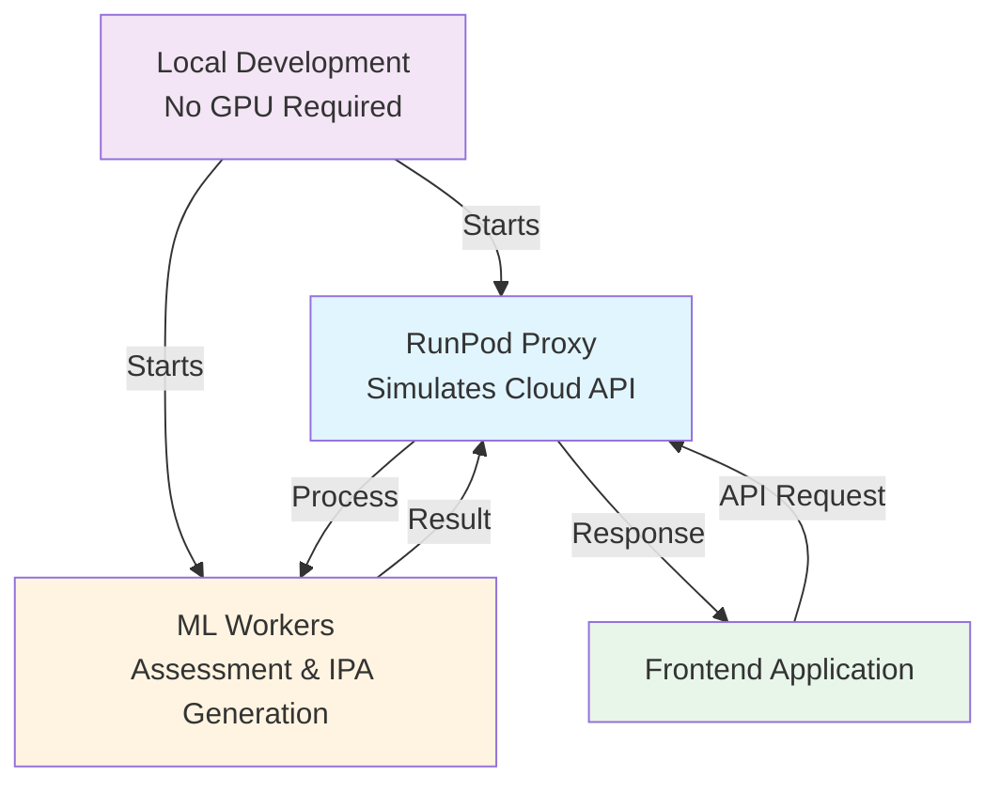
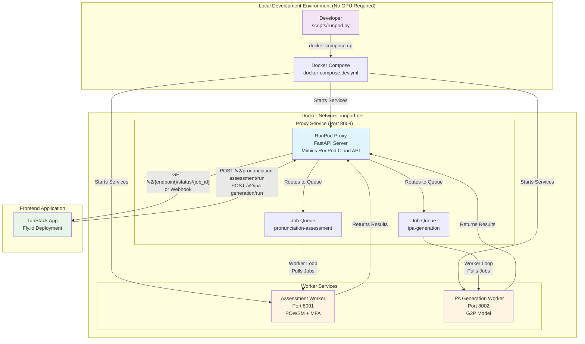

# Local RunPod Simulation Architecture

## Poster Version (Simplified)

## Detailed Version

## Description

**Development without GPU**: The development of the project was done without a GPU. Additionally, in order to save cost and keep the pace of development fast, RunPod Serverless endpoints were simulated locally via a proxy server.

**Architecture Flow**:
1. Developer runs `scripts/runpod.py` to start Docker Compose services locally
2. RunPod Proxy mimics the RunPod Cloud API interface, accepting requests from the frontend
3. Proxy routes requests to appropriate worker containers (Assessment or IPA Generation)
4. Workers process requests and return results through the proxy
5. Frontend receives status updates or webhook notifications

This architecture enables cost-effective local development while maintaining compatibility with the production RunPod Serverless API structure.

