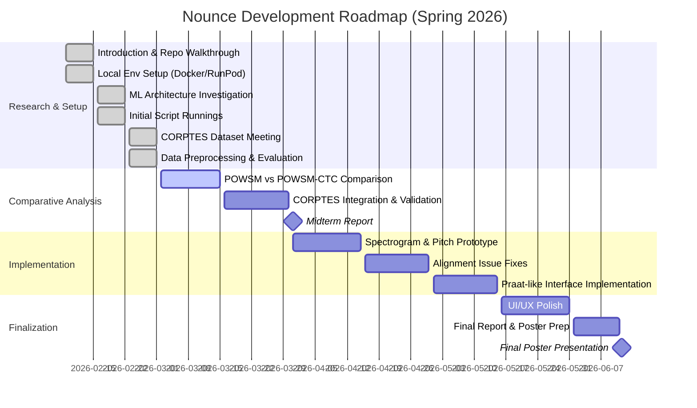

# Project Plan & Roadmap

This page outlines the timeline, milestones, and strategic direction of the **Nounce** project.

## Project Timeline (Spring 2026)
- **Start Date**: February 9, 2026
- **Midterm Report**: March 30, 2026
- **Final Presentation**: June 11, 2026

## Project Roadmap

## Major Milestones

### 1. Midterm Focus (March 30, 2026)
The primary goal for the midterm is to complete the comparative analysis between **POWSM** and **POWSM-CTC** models. We also aim to successfully validate and integrate the **CORPTES** dataset from Eskişehir Technical University to improve our Turkish-native speaker assessment capabilities.

### 2. Implementation Phase (April - May 2026)
Post-midterm, we will focus on building more advanced interfaces for phonetic analysis. This includes:
- **Praat-like Visualizations**: Spectrograms and pitch contours.
- **Exakt-like Tools**: Fine-grained phonetic alignment and manual review interfaces.
- **Alignment Fixes**: Improving the forced alignment (MFA) to ensure accurate phoneme-to-audio synchronization.

### 3. Final Goal (June 11, 2026)
A production-ready full-stack application providing phonetic assessment for Turkish-native English speakers, presented in a final poster session at Boğaziçi University.
