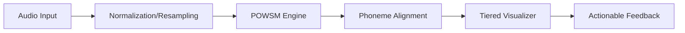

# Technical Details & Research

This page documents the technical research and specifications for the **Nounce** pronunciation assessment platform.

## ML Architecture: POWSM vs POWSM-CTC

The core of our pronunciation assessment engine is based on the **POWSM (Phonetic Open Whisper-Style Speech Model)**. We are currently evaluating two variants:

### 1. Standard POWSM
- **Task**: Phonetic transcription from audio (Phone Recognition) and text-to-phoneme conversion (G2P).
- **Pros**: Strong contextual awareness, good at handling phonological variations.
- **Cons**: Slower inference, requires more GPU memory.

### 2. POWSM-CTC (Connectionist Temporal Classification)
- **Task**: Aligned phonetic transcription with explicit timing.
- **Pros**: Faster inference, inherently aligned (provides timestamps without external forced aligner).
- **Cons**: Can be less accurate on short or noisy audio segments compared to the standard model.

### Comparative Benchmarks (In-Progress)
We are running benchmarks to compare:
- **Phone Error Rate (PER)**: Accuracy of phoneme detection.
- **Alignment Precision**: Accuracy of phoneme-to-audio synchronization.
- **Inference Latency**: Time taken to process 10s of audio.

## Dataset Overview

### 1. CORPTES (Eskişehir Technical University)
The **CORPTES** dataset is our primary target for improving assessment of Turkish-native English speakers. It provides:
- Large-scale recordings of Turkish L1 speakers reading English sentences.
- Expert-annotated phonetic transcriptions.
- Targeted pronunciation errors common to this population.

### 2. L2-ARCTIC
We also use **L2-ARCTIC** as a baseline dataset. It includes:
- Non-native English speech (including Turkish speakers).
- Word and phoneme-level annotations.

## Interface Specifications: Praat-like Tools

Our goal is to build an interface that rivals professional tools like **Praat** or **Exakt** for educational use.

### 1. Spectrogram and Pitch Contour
- **Library**: `Wavesurfer.js` with custom plugins.
- **Features**: 
  - Dynamic spectrogram generation from audio recordings.
  - Pitch tracking using autocorrelative or spectral methods.
  - Interactive zoom and time-selection.

### 2. Phoneme Alignment
- **Method**: Forced alignment using **MFA (Montreal Forced Aligner)** or **POWSM-CTC**.
- **Visualization**: A timeline-based "tier" view showing word and phoneme boundaries synchronized with the waveform.

